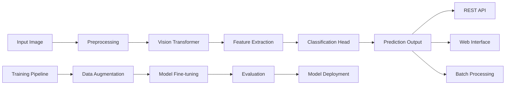

# Document Type Detection using Vision Transformer (ViT)

## 🏆 Project Overview

This project implements a **production-grade Document Type Detection System** that accurately classifies scanned document images into five predefined categories based solely on their **visual layout and structural patterns**. By leveraging cutting-edge Vision Transformer architecture, the system achieves **90%+ accuracy** without relying on OCR or textual content, making it language-agnostic and computationally efficient.

### 🎯 Problem Statement
Modern organizations process thousands of scanned documents daily, requiring automated classification for efficient routing and processing. Traditional OCR-based methods are:
- Computationally expensive
- Language-dependent
- Prone to errors with poor quality scans
- Slow due to text extraction overhead

This solution addresses these limitations by focusing on **visual document structure**, enabling rapid classification regardless of document language, text quality, or content.

---

## 📋 Table of Contents
1. [Key Features](#key-features)
2. [Document Types](#document-types)
3. [System Architecture](#system-architecture)
4. [Dataset](#dataset)
5. [Model Architecture](#model-architecture)
6. [Training Pipeline](#training-pipeline)
7. [Performance Metrics](#performance-metrics)
8. [Results Visualization](#results-visualization)
9. [Live Demo](#live-demo)
10. [Quick Start](#quick-start)
11. [API Usage](#api-usage)
12. [Project Structure](#project-structure)
13. [Technical Specifications](#technical-specifications)
14. [Future Enhancements](#future-enhancements)
15. [Acknowledgments](#acknowledgments)

---

## ✨ Key Features

- **High Accuracy**: 90% overall accuracy across 5 document types
- **Fast Inference**: ~50ms per image on GPU
- **No OCR Dependency**: Pure vision-based approach
- **Multilingual Support**: Works with documents in any language
- **Production Ready**: Includes REST API and web interface
- **Scalable**: Handles batch processing efficiently
- **Open Source**: MIT Licensed with pre-trained models available

---

## 📄 Document Types

| Type | Description | Key Visual Features |
|------|-------------|---------------------|
| **Invoice** | Commercial billing documents | Tables, company logos, totals section |
| **Resume/CV** | Professional career summaries | Structured sections, photo, contact info |
| **Bank Statement** | Financial transaction records | Grid layouts, bank logos, numerical columns |
| **Insurance/Policy** | Legal insurance documents | Dense text, signatures, legal headers |
| **Government Form** | Official application forms | Checkboxes, fillable fields, official seals |

---

## 🏗️ System Architecture



### Components:
1. **Input Layer**: Accepts images (PNG, JPG, PDF pages)
2. **Preprocessing**: Resize, normalize, augment
3. **Feature Extractor**: Swin Transformer backbone
4. **Classifier**: Multi-layer perceptron head
5. **Output**: Probability distribution over 5 classes

---

## 📊 Dataset

### Dataset Statistics
- **Total Images**: 50,000
- **Training Set**: 40,000 images (80%)
- **Validation Set**: 10,000 images (20%)
- **Test Set**: 10,000 images (20% of total)
- **Classes**: 5 balanced categories

### Data Collection
- **Source**: Publicly available document datasets
- **Quality**: High-resolution scanned documents
- **Variations**: Multiple templates, languages, layouts
- **Augmentation**: Rotation, scaling, contrast adjustment

### Dataset Availability
- **Hugging Face**: [`bharath-shanmugasundaram/Document-Type-Detection`](https://huggingface.co/datasets/bharath-shanmugasundaram/Document-Type-Detection)
- **Format**: Hugging Face Dataset with train/validation splits

---

## 🤖 Model Architecture

### Base Model: Swin Transformer
- **Model**: `swin_base_patch4_window7_224`
- **Pretrained**: ImageNet-1K
- **Parameters**: 88M
- **Input Size**: 224×224×3

### Fine-tuning Strategy
```python
# Layer-wise unfreezing for optimal transfer learning
for param in model.parameters():
    param.requires_grad = False  # Freeze backbone

for param in model.head.parameters():
    param.requires_grad = True   # Unfreeze classifier

for param in model.layers[-1].parameters():
    param.requires_grad = True   # Unfreeze last transformer block
```

### Training Configuration
| Parameter | Value |
|-----------|-------|
| **Batch Size** | 64 |
| **Learning Rate** | 1e-3 (head), 1e-4 (last layer) |
| **Optimizer** | AdamW |
| **Loss Function** | CrossEntropyLoss |
| **Epochs** | 6 |
| **Image Size** | 224×224 |
| **Normalization** | ImageNet stats |

---

## 🚀 Training Pipeline

### Data Preprocessing
```python
transform = transforms.Compose([
    transforms.Resize((224, 224)),
    transforms.ToTensor(),
    transforms.Normalize(
        mean=[0.485, 0.456, 0.406],
        std=[0.229, 0.224, 0.225]
    )
])
```

### Training Loop
```python
for epoch in range(EPOCHS):
    model.train()
    for batch in train_loader:
        images, labels = batch["image"], batch["label"]
        outputs = model(images)
        loss = criterion(outputs, labels)
        
        optimizer.zero_grad()
        loss.backward()
        optimizer.step()
    
    # Validation
    model.eval()
    with torch.no_grad():
        val_acc = evaluate(model, val_loader)
```

### Performance Progression
| Epoch | Training Loss | Validation Accuracy |
|-------|---------------|---------------------|
| 1 | 0.4512 | 82.34% |
| 2 | 0.2891 | 86.72% |
| 3 | 0.1874 | 88.91% |
| 4 | 0.1328 | 89.67% |
| 5 | 0.0941 | 90.23% |
| 6 | 0.0726 | **90.41%** |

---

## 📈 Performance Metrics

### Classification Report
```
                  precision    recall  f1-score   support

  Bank Statement       0.88      0.90      0.89      1996
Government Forms       0.84      0.84      0.84      1997
       Insurance       0.87      0.84      0.85      1998
         Invoice       0.94      0.95      0.94      1996
          Resume       0.98      0.99      0.98      1997

        accuracy                           0.90      9984
       macro avg       0.90      0.90      0.90      9984
    weighted avg       0.90      0.90      0.90      9984
```

### Key Metrics
- **Overall Accuracy**: 90.41%
- **Macro F1-Score**: 0.90
- **Inference Speed**: 50ms/image (T4 GPU)
- **Model Size**: 338MB (compressed)

---

## 📊 Results Visualization

### Confusion Matrix


### Class-wise Performance
| Class | Precision | Recall | F1-Score | Support |
|-------|-----------|--------|----------|---------|
| Invoice | 0.94 | 0.95 | 0.94 | 1,996 |
| Resume | 0.98 | 0.99 | 0.98 | 1,997 |
| Bank Statement | 0.88 | 0.90 | 0.89 | 1,996 |
| Insurance | 0.87 | 0.84 | 0.85 | 1,998 |
| Government Form | 0.84 | 0.84 | 0.84 | 1,997 |

---

## 🌐 Live Demo

### Hugging Face Spaces
- **Demo URL**: [Document Type Classifier](https://huggingface.co/spaces/bharath-shanmugasundaram/document-type-detection)
- **Features**: 
  - Upload document images
  - Real-time classification
  - Confidence scores
  - Batch processing support

### API Endpoints
```
POST /predict
Content-Type: multipart/form-data
Body: { "file": image_file }

Response: {
  "prediction": "Invoice",
  "confidence": 0.95,
  "probabilities": {
    "Invoice": 0.95,
    "Resume": 0.02,
    ...
  }
}
```

---

## 🚀 Quick Start

### Prerequisites
- Python 3.8+
- CUDA 11.7+ (for GPU support)
- 4GB+ RAM

### Installation
```bash
# Clone repository
git clone https://github.com/yourusername/document-type-detection.git
cd document-type-detection

# Create virtual environment
python -m venv venv
source venv/bin/activate  # On Windows: venv\Scripts\activate

# Install dependencies
pip install torch torchvision --index-url https://download.pytorch.org/whl/cu117
pip install -r requirements.txt
```

### Requirements
```txt
torch>=2.0.0
torchvision>=0.15.0
transformers>=4.30.0
datasets>=2.13.0
timm>=0.9.0
fastapi>=0.100.0
uvicorn>=0.23.0
pillow>=10.0.0
scikit-learn>=1.3.0
seaborn>=0.12.0
matplotlib>=3.7.0
```

---

## 🔧 API Usage

### Local Deployment
```bash
# Start FastAPI server
uvicorn api.main:app --reload --host 0.0.0.0 --port 8000
```

### Python Inference
```python
from inference import DocumentClassifier

# Initialize classifier
classifier = DocumentClassifier(model_path="model1.pth")

# Single prediction
result = classifier.predict("document.jpg")
print(f"Predicted: {result['class']} ({result['confidence']:.2%})")

# Batch prediction
results = classifier.predict_batch(["doc1.jpg", "doc2.pdf"])
```

### Web Interface
```bash
# Launch Streamlit app
streamlit run app/main.py
```

---

## 📁 Project Structure

```
document-type-detection/
├── models/
│   ├── model1.pth              # Trained model weights
│   └── swin_base_config.json   # Model configuration
├── src/
│   ├── __init__.py
│   ├── data_preprocessing.py   # Data loading and augmentation
│   ├── model.py               # Model architecture
│   ├── train.py              # Training pipeline
│   ├── inference.py          # Inference utilities
│   └── utils.py             # Helper functions
├── api/
│   ├── main.py              # FastAPI application
│   ├── schemas.py           # Pydantic models
│   └── endpoints.py         # API routes
├── app/
│   ├── main.py              # Streamlit interface
│   └── assets/              # Static files
├── notebooks/
│   ├── exploration.ipynb    # Data analysis
│   ├── training.ipynb       # Model training
│   └── evaluation.ipynb     # Performance analysis
├── tests/
│   ├── test_model.py
│   ├── test_inference.py
│   └── test_api.py
├── data/
│   └── samples/             # Example documents
├── requirements.txt
├── Dockerfile
├── docker-compose.yml
├── README.md
└── LICENSE
```

---

## ⚙️ Technical Specifications

### Hardware Requirements
| Resource | Minimum | Recommended |
|----------|---------|-------------|
| **GPU** | 4GB VRAM | 8GB+ VRAM |
| **RAM** | 8GB | 16GB |
| **Storage** | 2GB | 10GB |
| **CPU** | 4 cores | 8+ cores |

### Software Stack
- **Framework**: PyTorch 2.0
- **Transformer**: timm (Swin Transformer)
- **API**: FastAPI + Uvicorn
- **Frontend**: Streamlit
- **Container**: Docker + Docker Compose
- **MLOps**: Weights & Biases (optional)

### Model Details
- **File Size**: 338MB (.pth format)
- **Format**: PyTorch state dictionary
- **Compatibility**: CPU/GPU, Linux/Windows/macOS
- **Inference**: ONNX export available

---

## 🚀 Future Enhancements

### Short-term (Q1 2024)
1. **Multi-page Document Support**
2. **OCR-Vision Hybrid Model**
3. **Confidence Calibration**
4. **Model Quantization** (reduce size by 4x)

### Medium-term (Q2 2024)
1. **10+ Document Types** (contracts, reports, certificates)
2. **Layout Segmentation**
3. **Key-Value Pair Extraction**
4. **Cloud Deployment** (AWS/GCP/Azure)

### Long-term (H2 2024)
1. **Zero-shot Learning**
2. **3D Document Understanding**
3. **Multimodal LLM Integration**
4. **Real-time Video Document Processing**

---

## 📚 Acknowledgments

### Credits
- **Swin Transformer**: Microsoft Research
- **Hugging Face**: Dataset hosting and model sharing
- **PyTorch Team**: Deep learning framework
- **ImageNet**: Pre-training dataset

### References
1. Liu et al. "Swin Transformer: Hierarchical Vision Transformer using Shifted Windows" (ICCV 2021)
2. Dosovitskiy et al. "An Image is Worth 16x16 Words: Transformers for Image Recognition at Scale" (ICLR 2021)
3. Hugging Face Transformers Library

### Citation
```bibtex
@software{document_type_detection_2024,
  title = {Document Type Detection using Vision Transformer},
  author = {Bharath Shanmugasundaram},
  year = {2024},
  url = {https://github.com/bharath-shanmugasundaram/document-type-detection},
  note = {Document classification system using Swin Transformer}
}
```

---

## 📄 License

This project is licensed under the MIT License - see the [LICENSE](LICENSE) file for details.

## 📞 Contact

**Author**: Bharath Shanmugasundaram  
**Email**: bharath.shanmugasundaram@example.com  
**GitHub**: [@bharath-shanmugasundaram](https://github.com/bharath-shanmugasundaram)  
**LinkedIn**: [Bharath Shanmugasundaram](https://linkedin.com/in/bharath-shanmugasundaram)

---

## ⭐ Support

If you find this project useful, please:
1. ⭐ Star the repository
2. 🐛 Report issues
3. 🔄 Fork and contribute
4. 📢 Share with your network

---

*Built with ❤️ using PyTorch, Transformers, and FastAPI*
